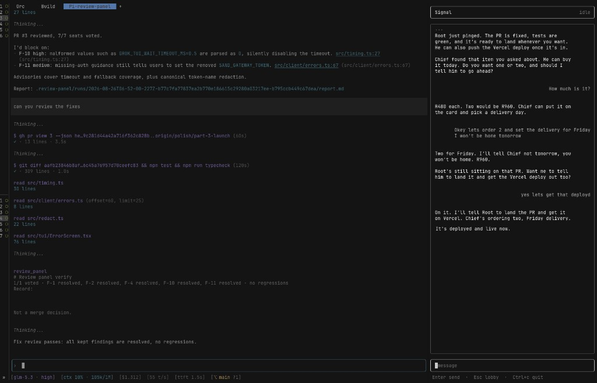

# grokbot-tui

Terminal chat for your Grok Bot bots and channels.

This is not an official xAI or Cursor product. There is no public Grok Bot chat API. The TUI posts to the host gateway (`POST {gatewayUrl}/api/{method}` with a bearer token). Command names and response shapes can change without notice. Treat the gateway token and every transcript as secrets.

## Screenshots




## Requirements

- Node.js 22 or newer
- An interactive terminal (TTY)
- Ghostty if you want host images drawn with Kitty graphics (other terminals show placeholders)


## Install

```sh
npm install -g grokbot-tui
grok-tui
```

Without a global install:

```sh
npx grokbot-tui
```

From a clone:

```sh
git clone https://github.com/smarzban/grokbot-tui.git
cd grokbot-tui
npm install
cp .env.example .env
npm start
```


## Try it without a host

```sh
npm start -- --mock
# or: npm run start:mock
# or: grok-tui --mock
```

The mock host includes Ada, a channel, and a sample photo so you can exercise the lobby, chat, scroll, and images without a live gateway.

## Connect to a real host

Pick one path. Do not put port 1340 on the public internet.

### macOS with the Grok Bot desktop app

1. Open Grok Bot and sign in.
2. Allow the Keychain prompt for "Grok Bot Safe Storage" when asked.
3. Run `grok-tui` or `npm start` with no token in `.env`.

The TUI reads `~/Library/Application Support/Grok Bot/gateway-descriptor.json`, decrypts the session, and keeps the gateway URL path (only a trailing slash is trimmed). A `GROKBOT_GATEWAY_URL` alone, without a token, does not block this desktop path.

### Same machine as the host

Put both values in `.env`:

```sh
GROKBOT_GATEWAY_URL=http://127.0.0.1:1340
GROKBOT_GATEWAY_TOKEN=...
```


### Laptop over Tailscale or SSH tunnel

```sh
GROKBOT_GATEWAY_URL=http://<tailscale-or-localhost-tunnel>:1340
GROKBOT_GATEWAY_TOKEN=...
```

Optional: `GROK_TUI_DEFAULT_AGENT=Ada` opens that bot or channel and skips the lobby.

Connectivity check is `listAgents`. There is no separate health probe.

## What you can do

- Open the lobby and pick a bot or a channel (channels show members)
- Chat in a framed alternate-screen UI
- In a 1:1 chat, wait for the reply (default wait cap is 10 minutes; Esc cancels the wait and asks the host to interrupt when supported)
- In a channel, send without blocking; idle poll picks up each member's turn and "X is answering…" when a member is running
- Scroll history with PageUp / PageDown, the wheel, Home / End, and Ctrl+u / Ctrl+d
- Mention channel members with `@` plus a prefix; Tab or Enter inserts `@Name` 
- Paste a local image path as the message text to draw it in Ghostty
- Leave chat for the lobby with Esc (when not waiting) or Ctrl+b

Out of scope in v1: creating or deleting agents or channels, seating members, streaming replies, Slack, rich markdown, and uploading attachments from the compose box.

## Keys


| Key                                                | Where          | Action                                                                   |
| -------------------------------------------------- | -------------- | ------------------------------------------------------------------------ |
| ↑ ↓ / j k, Enter                                   | lobby          | Move / open                                                              |
| r                                                  | lobby / error  | Refresh roster / retry connect                                           |
| q                                                  | lobby / error  | Quit                                                                     |
| Esc                                                | chat (idle)    | Open the lobby                                                           |
| Esc                                                | chat (waiting) | Cancel the wait and interrupt the host run when supported                |
| Esc                                                | mention menu   | Close the menu (stay in the channel)                                     |
| Ctrl+b                                             | chat           | Open the lobby (cancels a wait first if one is in flight)                |
| Enter                                              | chat compose   | Send                                                                     |
| Shift+Enter / Ctrl+J                               | chat compose   | Newline                                                                  |
| ← → / Ctrl+a / Ctrl+e                              | chat compose   | Move caret (Ctrl+a/e = whole draft). Cmd+← / Cmd+→ = current visual line |
| Cmd+Delete / Cmd+Backspace                         | chat compose   | Clear the draft                                                          |
| PgUp / PgDn / wheel / Home / End / Ctrl+u / Ctrl+d | chat           | Scroll history. ↑ ↓ scroll only while the draft is a single line         |
| Tab / Enter / ↑ ↓                                  | mention menu   | Complete or move                                                         |
| Ctrl+c                                             | anywhere       | Quit                                                                     |


Footer in chat: `Enter send  ·  Esc lobby  ·  Ctrl+c quit`.

## Env vars

See `.env.example`. Never print, log, or commit `GROKBOT_GATEWAY_TOKEN` or the desktop session payload. Only these names are read (legacy `SAND_*` / `GROK_BOT_*` names are ignored).


| Variable                   | Purpose                                                                                          |
| -------------------------- | ------------------------------------------------------------------------------------------------ |
| `GROKBOT_GATEWAY_URL`      | Gateway origin. Keep any path; only a trailing slash is trimmed                                  |
| `GROKBOT_GATEWAY_TOKEN`    | Gateway token                                                                                    |
| `GROKBOT_GATEWAY_PORT`     | Localhost port when a token is set without a URL (default `1340`)                                |
| `GROK_TUI_DEFAULT_AGENT`   | Bot or channel name/id to open first                                                             |
| `GROK_TUI_MOCK=1`          | Force the in-process mock host                                                                   |
| `GROK_TUI_WAIT_TIMEOUT_MS` | 1:1 wait cap in ms (default `600000`). Exact `0` waits until Esc. Invalid values use the default |
| `GROK_TUI_POLL_MS`         | Idle transcript poll interval (default `1500`, minimum `250`)                                    |


## Images

Ghostty speaks the Kitty graphics protocol. You do not need `viu`, `chafa`, or a Ghostty config toggle.

- Host attachments and bot images are fetched through the gateway (`readAttachmentImage` for box paths such as `/home/box/sand-data/...`), cached under the system temp dir, then painted when the full image block is on screen.
- Paste a local image path as the message to draw that file the same way.
- Filename-only turns stay `[image] filename`.
- iTerm and Terminal.app usually show placeholders, not Kitty placements.

`npm start -- --mock` seeds Ada with `fixtures/mock-photo.png` and a name-only placeholder so you can check both paths.

## Troubleshooting


| Symptom                      | What to try                                                                                                |
| ---------------------------- | ---------------------------------------------------------------------------------------------------------- |
| "Missing gateway token"      | Set `GROKBOT_GATEWAY_TOKEN` in `.env`, or open the Grok Bot desktop app and Allow Keychain access          |
| "Gateway rejected the token" | Refresh the token or re-sign into the desktop app. Do not paste the token into chat                        |
| "Grok Bot host is down"      | Start the host, check the tunnel URL, or run `--mock`                                                      |
| Lobby is empty after a blip  | Press `r` on the lobby or error screen to refresh                                                          |
| Esc does not leave chat      | If the header shows waiting/sent, Esc cancels the wait first. Press Esc again for the lobby, or use Ctrl+b |
| Images stay as `[image] …`   | Use Ghostty, keep the full picture block on screen, and confirm the host can serve `readAttachmentImage`   |


## Security

- Tokens stay in memory (env or desktop session). They are not written to logs or the UI.
- Error text redacts bearer tokens and `GROKBOT_GATEWAY_TOKEN=…` fragments.
- The TUI shows transcript text only, not raw gateway payloads.
- Destructive host commands (`deleteAgent`, box reset, and similar) are not exposed.


## Develop from a clone

```sh
npm start          # tsx src/cli.tsx
npm run start:mock
npm test
npm run typecheck
npm run build      # writes dist/ for the grok-tui bin
```

Tests cover the mock host, scripted gateway `fetch`, desktop Keychain decrypt, layout/compose/keys/mouse, poll/roster, config, and chat poll snapshots. Full Ink screen renders are not in CI yet.

## Release

1. Update `CHANGELOG.md` and bump `package.json` / `package-lock.json`.
2. Commit on `main`, tag `vX.Y.Z`, and push the branch and tag.
3. The [release workflow](.github/workflows/release.yml) runs tests, publishes to npm via a [Trusted Publisher](https://docs.npmjs.com/trusted-publishers), and opens or updates the GitHub release from the changelog section.

Trusted Publisher on npm must match this repo exactly: owner `smarzban`, repository `grokbot-tui`, workflow filename `release.yml`. The workflow uses Node 24 (npm ≥ 11.5.1) for OIDC publish — do not set `NODE_AUTH_TOKEN` / `NPM_TOKEN` in that job.

CI on pull requests uses [.github/workflows/ci.yml](.github/workflows/ci.yml).